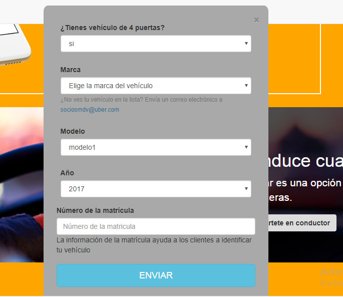

###LabCar
Recrea la siguiente página web
##1. LA VERSIÓN WEB

##2. LA VERSIÓN MOVIL
Y obviamente no podemos dejar de lado la versión móvil, así que créala como segunda parte.

##3. MODALES
Como extra puedes añadir los modales necesarios en la versión web

